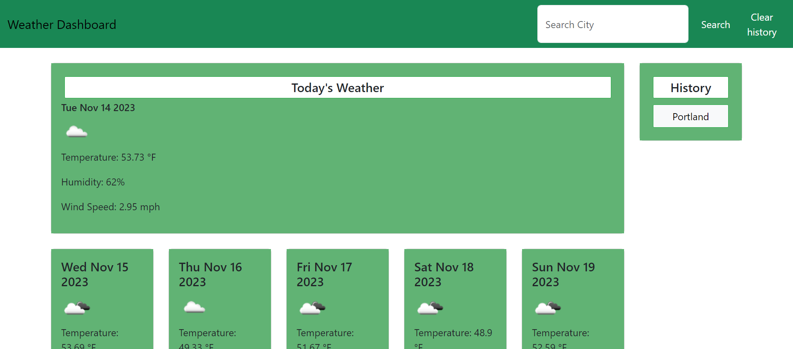

# 
Title: Weather App
 

## Description
The weather app allows user to search by city name to get the current day weather and the 5-day forecast. A users history is also saved so it can be viewed again.
     
## Installation

## Usage
Weather app is used to search a city to find weather information. 
    
## Contributing
To make contributions please follow the link to [Github Profile](https://github.com/justin-schultz37/weather-forecast)
    
## Tests

## License
For more information, view the [MIT LICENSE](https://choosealicense.com/licenses/mit/) link

MIT License

Copyright (c) [2023] [Justin Schultz]

Permission is hereby granted, free of charge, to any person obtaining a copy
of this software and associated documentation files (the "Software"), to deal
in the Software without restriction, including without limitation the rights
to use, copy, modify, merge, publish, distribute, sublicense, and/or sell
copies of the Software, and to permit persons to whom the Software is
furnished to do so, subject to the following conditions:

The above copyright notice and this permission notice shall be included in all
copies or substantial portions of the Software.